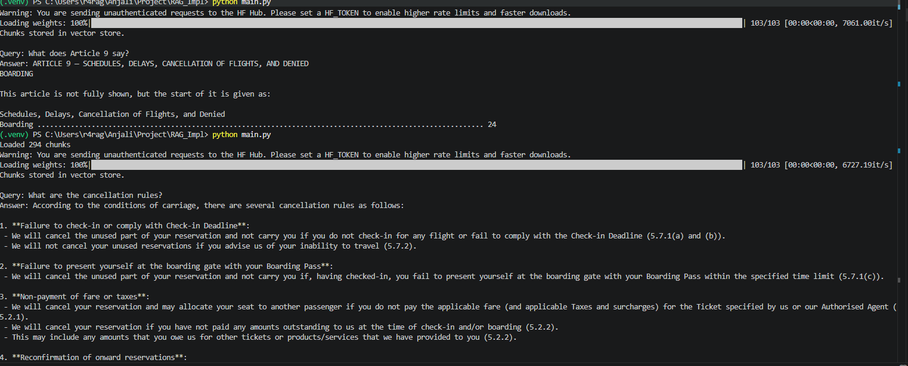

# Dense vs Sparse Retrieval — A Complete Guide

## Q: What is the difference between dense retrieval and sparse retrieval (BM25)?

Retrieval is often described as "finding similar text," but that description is too vague to be useful. To actually understand it, you need to know *how* the system decides what counts as similar — and that is where sparse and dense retrieval differ completely.

---

## Sparse Retrieval (BM25) — Matching Words

Think of sparse retrieval like a Ctrl+F search, but smarter.

It looks at the actual words in your query and checks how often those exact words appear in each document. If the word is there, the document scores points. If the word is not there, it scores nothing. That is it.

The "sparse" part just means most scores are zero — out of 50,000 words in the vocabulary, only the handful that appear in your query actually matter.

BM25 scores a document higher when:
- **The query word appears often** in that document (Term Frequency)
- **The query word is rare** across all documents (Inverse Document Frequency) — because finding "cancellation" in a document is more meaningful than finding "the"

**Where it works well:** exact terms, product codes, names, invoice numbers — anything where the specific word matters.

**Where it fails:** if you search *"how do I cancel my order"* and the document says *"steps to terminate a booking"* — BM25 scores zero because none of the words overlap, even though the meaning is identical.

---

## Dense Retrieval — Matching Meaning

Dense retrieval takes a completely different approach. Instead of looking at words, it compresses the *meaning* of text into a list of numbers called an embedding (e.g., 384 numbers for `all-MiniLM-L6-v2`).

Every piece of text — your query and every document chunk — gets converted into one of these number lists. Then retrieval becomes simple: find the chunks whose numbers are closest to your query's numbers.

Because the model was trained on language, words like "cancel", "terminate", and "withdraw" end up with similar numbers. So even without a single word in common, the right document gets found.

**Where it works well:** paraphrased questions, synonyms, conceptual queries — anything where meaning matters more than exact wording.

**Where it fails:** exact codes, IDs, or rare proper nouns. If you search for error code `ERR_4092`, the model has no idea that specific string is important and may return something semantically "close" that is completely wrong.

---

## The Real Difference

> Sparse retrieval has a **word bias** — it only rewards exact matches.
> Dense retrieval has a **meaning bias** — it finds related concepts even without shared words.

Neither is better. They fail in opposite situations.

| | Sparse (BM25) | Dense |
|---|---|---|
| Matches | Exact words | Meaning / concepts |
| Great for | Codes, names, rare terms | Synonyms, paraphrasing |
| Fails when | Words differ but meaning is same | Exact strings matter |
| Speed | Very fast | Slower (vector search) |
| Needs training | No | Yes (or pretrained model) |

---

## Real Examples from This Project

This project uses an Emirates ticket (booking ref KB546J) as the test document. Here is exactly how dense and hybrid behave on real queries from that document.

### Queries Dense Handles Well

These work because the surrounding words carry semantic meaning:

| Query | Why Dense Works |
|---|---|
| "What is my carry-on baggage allowance?" | "carry-on", "baggage", "allowance" all have clear meaning |
| "What happens if my flight is cancelled?" | "cancelled", "flight" are semantically rich |
| "What time does my flight depart?" | "depart", "flight", "time" guide retrieval correctly |
| "What items are forbidden in baggage?" | "forbidden", "baggage" pull the right chunk |
| "What does AGT 86491856 AE mean?" | Works because *surrounding text* ("Issued by", "Date") carries meaning — dense gets lucky via context, not the code itself |

### Queries Where Dense Struggles (Hybrid Would Help)

These fail because the query is just a code or number with no semantic weight:

| Query | Why Dense Fails | Why Hybrid Works |
|---|---|---|
| "What is ticket number 176 2206583771?" | Long number — dense treats it like random noise | BM25 finds exact number match instantly |
| "What is Skywards number EK00770652094?" | Specific ID — no semantic meaning to embed | BM25 exact match |
| "What does clause 3.3 say?" | Section number — dense has no idea what 3.3 means | BM25 finds "3.3" in the document directly |
| "What does Article 9 say?" | Article number alone — no context for dense to work with | BM25 finds "Article 9" by exact word match |

### The Article 9 Example — A Key Lesson

Query: *"What does Article 9 say?"*

Dense retrieval sees: `article` + `9` → very weak semantic signal → retrieves wrong or incomplete chunks.

The fix is simple — query by meaning instead of number:

| Instead of | Use |
|---|---|
| "What does Article 9 say?" | "What are the rules for flight cancellation and denied boarding?" |
| "What is clause 3.3?" | "What are the check-in time requirements?" |
| "What does section 12 cover?" | "What is the baggage liability policy?" |

This works because Article 9 *is about* cancellations and denied boarding — dense finds the content by meaning even without knowing the article number.

**Rule:** Query by topic, not by number — until hybrid retrieval is added.

---

## Why Dense Worked Better Than Expected on This Project

When tested, the system answered almost all queries correctly — even ones predicted to fail. Here is why:

1. **Small document (3 pages)** — with `k=5` chunks retrieved, the system pulls most of the document anyway
2. **Rich surrounding context** — codes like `AGT 86491856 AE` appear next to helpful labels like "Issued by / Date" which give dense retrieval something to work with
3. **LLM reasoning on top** — even when retrieval brings a slightly wrong chunk, the LLM reasons through it and gives a sensible answer

**The gap between dense-only and hybrid only becomes visible at scale** — when you have 50+ documents, the right chunk competes with hundreds of others, and exact codes appear in tables without helpful labels.

---

## Why Hybrid Is Still Needed — The Scale Argument

| Scenario | Dense Only | Hybrid |
|---|---|---|
| 1 document, 3 pages (current) | Works well | Works well |
| 5 documents, 50 pages | Starts missing exact codes | Reliable |
| 20 documents, 200 pages | Frequently misses codes/IDs | Reliable |
| 100 documents, 1000 pages | Unreliable for exact terms | Reliable |

As you add more PDFs to `docs/` — conditions of carriage, more tickets, policy documents — the dense-only system will start missing exact term queries. That is when hybrid pays off.

---

## Hybrid Search — Getting the Best of Both

Since they fail in opposite ways, the fix is to run both and combine the results.

1. BM25 returns its top results ranked by word match
2. Dense retrieval returns its top results ranked by meaning match
3. Both lists are merged using **Reciprocal Rank Fusion (RRF)** — a simple formula that rewards documents that ranked high in *either* list

You do not need to pick one. Hybrid search uses BM25 as a safety net for exact matches and dense retrieval as a safety net for semantic gaps.

**Example from this project:**

Query: *"What is the refund process for a cancelled flight?"*

- BM25 finds chunks with the exact words "refund" or "cancelled"
- Dense retrieval finds chunks about "reimbursement", "booking reversal", "compensation policy" — even if those query words never appear in the document

Hybrid catches both. You almost never miss a relevant chunk just because the wording was different.

---

## Summary

> Dense retrieval is great out of the box for meaning-based queries.
> BM25 is great for exact terms, codes, and IDs.
> Hybrid combines both — and is the standard approach in production RAG systems.

